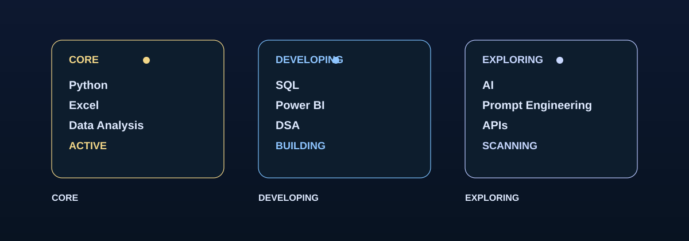
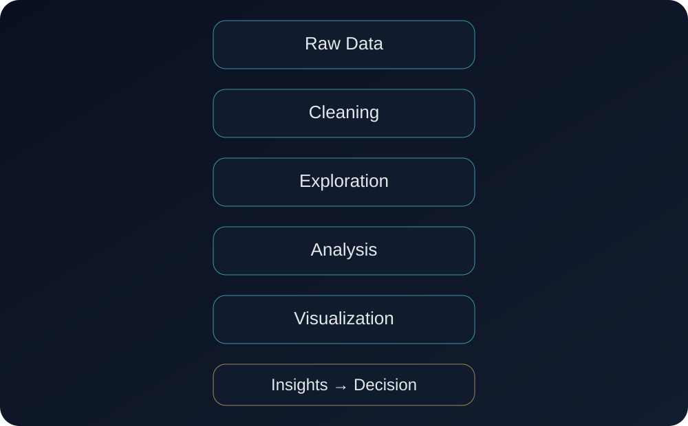
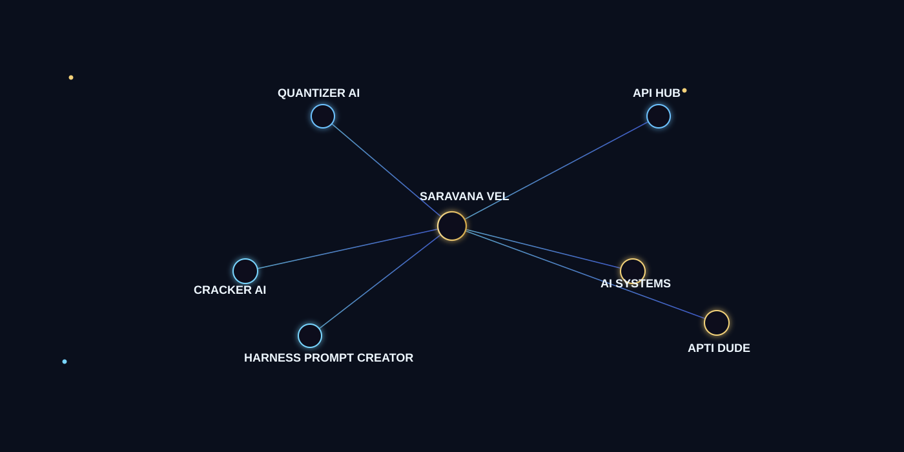
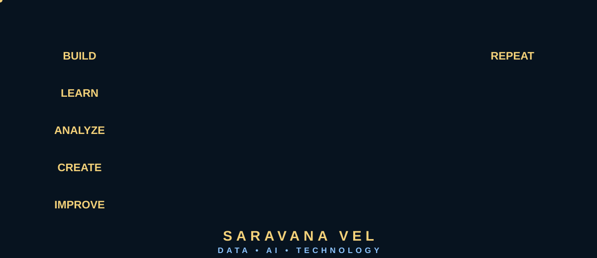

# SARAVANA VEL // LIVE TECH CORE

<div align="center">
  
</div>

<p align="center">
  <a href="https://github.com/saravanavel07" target="_blank">
    
  </a>
  <a href="https://www.linkedin.com/in/saravana-vel-ba4937280" target="_blank">
    
  </a>
  <a href="https://leetcode.com/u/saravana_6/" target="_blank">
    
  </a>
</p>

<h2 align="center" style="margin-top: 8px; color: #E8EDF7; letter-spacing: 0.18em;">SARAVANA VEL</h2>
<p align="center" style="margin-top: 6px; font-weight: 700; letter-spacing: 0.12em; color: #BFD5FF;">
  ASPIRING DATA ANALYST · AI ENTHUSIAST · PYTHON DEVELOPER
</p>

<p align="center" style="margin-top: 12px; color: #D8B76A; font-size: 1.05rem; font-style: italic;">
  “Turning data into insights. Turning ideas into working projects.”
</p>

---

## VEL // LIVE TECH CORE

I am building a practical foundation in data analysis, Python, SQL, AI, and technology-driven problem solving. My focus is on continuous learning, project development, and turning data into clear, useful decisions.

- Aspiring Data Analyst
- AI Enthusiast
- Python Developer
- Learning SQL, Power BI, APIs, and real-world analytics workflows
- Building project-based technical experience with clear problem-solving goals

---

## ABOUT ME

I am developing practical skills in data analysis, Python programming, SQL, Excel, Power BI, and AI-related technologies. My work emphasizes analytical thinking, structured problem-solving, project creation, and data-driven decision-making.

My current skill profile is honest and evolving:

- Python: Intermediate
- Excel: Intermediate
- Data Analysis: Intermediate
- SQL: Beginner
- Java: Basic
- Power BI: Learning
- Git and GitHub: Project-development tools
- AI and prompt engineering: Developing practical knowledge

I value consistent learning, real project execution, and improving technical depth through hands-on work rather than guessing or overstating proficiency.

---

## TECHNICAL SKILL ARCHITECTURE

| Domain | Focus | Current status |
| --- | --- | --- |
| Data Analytics | Python, Excel, data cleaning, exploratory analysis, visualization, reporting | Intermediate |
| Programming | Python fundamentals, SQL basics, Java basics | Developing |
| Business Intelligence | Power BI learning, dashboards, KPI analysis, insight communication | Learning |
| AI and Data Science | AI fundamentals, prompt engineering, APIs, project concepts | Developing |
| Developer Workflow | Git, GitHub, documentation, project organization | Active |

### Skill focus areas

- Data cleaning and exploratory analysis
- Practical reporting and KPI interpretation
- Python-based automation and data processing
- SQL fundamentals and database thinking
- Power BI dashboard learning and insight communication
- AI experimentation, prompt design, and API-powered workflows
- Git-based project organization and documentation practices

---

## FEATURED PROJECTS

The repository list below reflects public projects that are visible and relevant to the current learning and development journey. Statuses are presented conservatively and without claiming usage, deployment, or commercial scale.

### Verified public repositories

| Project | Purpose | Status | Repository |
| --- | --- | --- | --- |
| APIHUB | API-focused development project | Public repo available | [APIHUB](https://github.com/saravanavel07/APIHUB) |
| ViewTex | Semantic-search learning project | Public repo available | [ViewTex](https://github.com/saravanavel07/ViewTex) |
| Quantizer-Ai-Pipeline | AI and data-science platform concept | Public repo available | [Quantizer-Ai-Pipeline](https://github.com/saravanavel07/Quantizer-Ai-Pipeline) |
| VELA's AI / SV | AI workspace concept | Public repo available | [VELA-s-AI](https://github.com/saravanavel07/VELA-s-AI) |
| APTI DUDE | Aptitude-learning application concept | Public repo available | [APTIDUDE](https://github.com/saravanavel07/APTIDUDE) |
| The Prompt Builder | Prompt-improvement tool concept | Public repo available | [The-Prompt-Builder](https://github.com/saravanavel07/The-Prompt-Builder) |

### Project concept placeholders

| Concept | Purpose | Status |
| --- | --- | --- |
| Stock Market Streaming | Python-oriented market data, analytics pipelines, and forecasting concept | Conceptual / in-progress |
| Harness Prompt Creator | Prompt optimization and structured-generation concept | Placeholder or not yet publicly verified |
| VELA's AI / SV | AI workspace and experimentation concept | Public concept repo exists |

> Unverified or concept-only items are intentionally labeled as placeholders rather than being described as live products or deployed systems.

---

## DATA VISUALIZATION & DEV WORKFLOW

<div align="center">
  
</div>

This profile reflects a practical development approach rather than raw activity numbers. The focus is on thoughtful project work, learning continuity, and technical problem-solving.

- Public project work and code-based experimentation
- Data-analysis learning through structured practice
- Python and SQL skill progression
- AI and prompt engineering exploration
- GitHub repository-driven development workflow

---

## ANALYTICAL PIPELINE

<div align="center">
  
</div>

```text
RAW DATA → CLEANING → EXPLORATION → ANALYSIS → VISUALIZATION → INSIGHTS
```

This pipeline symbolizes the direction of my Data Analyst journey: building a consistent, practical workflow from raw information to decision-support insight.

---

## LEARNING & CAREER DIRECTION

I am actively developing in the following areas:

- Data analytics and business intelligence
- Python problem-solving and algorithmic thinking
- SQL and database fundamentals
- Power BI and dashboard development
- AI tools, APIs, and practical experimentation

Current progress is focused on building reliable fundamentals, applying learning to real projects, and improving technical clarity over time.

---

## GITHUB PROFILE SNAPSHOT

<div align="center">
  
</div>

```text
PROJECTS: API-focused, AI, analytics, and learning-driven
BUILDING: Python, SQL basics, Power BI exploration, prompt engineering
FOCUS: Data understanding, project execution, and AI-assisted development
STATUS: Growth-oriented, public-work-in-progress
```

---

## CONNECT

- GitHub: https://github.com/saravanavel07
- LinkedIn: https://www.linkedin.com/in/saravana-vel-ba4937280
- LeetCode: https://leetcode.com/u/saravana_6/

---

<div align="center">
  
</div>

<p align="center" style="font-size: 1.1rem; font-weight: 700; letter-spacing: 0.18em; color: #D8B76A;">
  BUILD WITH PURPOSE. ANALYZE WITH CLARITY. KEEP ITERATING.
</p>

<h3 align="center" style="color: #E8EDF7; margin-top: 12px; letter-spacing: 0.18em;">SARAVANA VEL</h3>

---

> VEL // LIVE TECH CORE is a personal technology profile focused on data analysis, Python development, AI learning, and project-based growth. It is designed to reflect a credible and evolving technical journey without overstating qualifications or claiming unsupported metrics.
