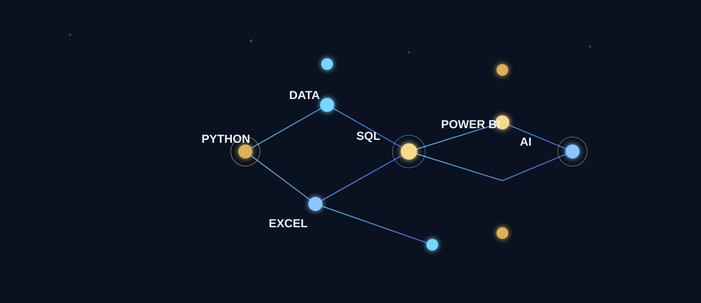
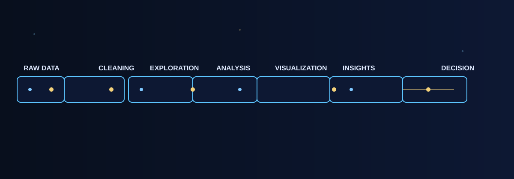

<div align="center">
  
</div>

<h1 align="center" style="margin: 0; font-size: 2.8rem; letter-spacing: 0.12em; color: #f4d27a;">SARAVANA VEL</h1>

<p align="center" style="font-size: 1.2rem; font-weight: 700; color: #dfeaff; margin-top: 10px; margin-bottom: 0;">
  <strong>Aspiring Data Analyst • AI Enthusiast • Python Developer</strong>
</p>

<p align="center" style="font-size: 1rem; color: #8cc9ff; margin-top: 6px; margin-bottom: 18px;">
  <strong>Data • AI • Analytics • Technology</strong>
</p>

<p align="center" style="font-style: italic; color: #dfeaff; margin-top: 0; margin-bottom: 18px;">
  Building practical solutions where data, programming, and artificial intelligence meet.
</p>

<p align="center">
  <a href="https://github.com/saravanavel07" target="_blank">
    
  </a>
  <a href="https://www.linkedin.com/in/saravana-vel-ba4937280/" target="_blank">
    
  </a>
  <a href="#project-command-center">
    
  </a>
</p>

<p align="center">
  
</p>

---

## ROYAL TECH COMMAND CENTER

### ABOUT ME

I’m developing my skills in Data Analytics, Python, SQL, Excel, Power BI, Java, AI, Prompt Engineering, APIs, and the fundamentals of Data Science. My goal is to grow into a strong data and technology professional while building practical projects that improve both technical understanding and problem-solving ability.

I’m actively learning, experimenting, and improving. My work is centered on combining analytical thinking with coding, data workflows, and AI-driven tools to create useful, grounded solutions.

---

## ADVANCED TECH STACK

<div align="center">
  
</div>

### PROGRAMMING
- Python — <strong>CORE</strong>
- Java — <strong>LEARNING</strong>
- SQL — <strong>CORE</strong>

### DATA
- Excel — <strong>CORE</strong>
- Power BI — <strong>INTERMEDIATE</strong>
- Data Analysis — <strong>CORE</strong>
- Data Visualization — <strong>INTERMEDIATE</strong>

### AI
- Artificial Intelligence — <strong>LEARNING</strong>
- Prompt Engineering — <strong>INTERMEDIATE</strong>
- AI Tools — <strong>LEARNING</strong>
- Data Science — <strong>LEARNING</strong>

### DEVELOPMENT
- Git — <strong>INTERMEDIATE</strong>
- GitHub — <strong>CORE</strong>
- APIs — <strong>INTERMEDIATE</strong>
- Jupyter — <strong>LEARNING</strong>
- Google Colab — <strong>LEARNING</strong>

### CURRENT EXPLORATION
- DSA — <strong>EXPLORING</strong>
- Cloud — <strong>EXPLORING</strong>
- DevOps — <strong>EXPLORING</strong>
- Docker — <strong>EXPLORING</strong>
- CI/CD — <strong>EXPLORING</strong>
- Grafana — <strong>EXPLORING</strong>

---

## DATA → INSIGHT

<p align="center">
  
</p>

```text
RAW DATA
   ↓
DATA CLEANING
   ↓
EXPLORATION
   ↓
ANALYSIS
   ↓
VISUALIZATION
   ↓
INSIGHTS
   ↓
DECISION
```

---

## PROJECT COMMAND CENTER

<p align="center">
  
</p>

### API HUB
- PROJECT: API HUB
- CATEGORY: API / Developer Tools / Integration
- TECHNOLOGY: Python, APIs, Integration
- STATUS: BUILDING
- GITHUB: TBD

### QUANTIZER AI
- PROJECT: QUANTIZER AI
- CATEGORY: AI / Data Science / Agentic Systems
- TECHNOLOGY: AI, Data Science, Automation
- STATUS: CONCEPTUAL
- GITHUB: TBD

### APTI DUDE
- PROJECT: APTI DUDE
- CATEGORY: Education / AI / Assessment
- TECHNOLOGY: Python, Logic, Analytics, Learning Systems
- STATUS: IN DEVELOPMENT
- GITHUB: TBD

### CRACKER AI
- PROJECT: CRACKER AI
- CATEGORY: AI / Data Science / Open Source
- TECHNOLOGY: Python, AI, Plugins, Data Science
- STATUS: EXPLORING
- GITHUB: TBD

### HARNESS PROMPT CREATOR
- PROJECT: HARNESS PROMPT CREATOR
- CATEGORY: Python / Prompt Engineering / AI
- TECHNOLOGY: Python, Prompt Engineering, Iteration Workflow
- STATUS: BUILDING
- GITHUB: TBD

---

## CODE • SOLVE • IMPROVE

### LeetCode
- Username: `saravana_6`
- Profile: https://leetcode.com/saravana_6/

### HackerRank
- Learning and practicing problem solving through platform-based challenges.
- Focus: logic, coding patterns, DSA fundamentals, and consistency.

### CodeChef
- Part of the broader problem-solving and DSA learning journey.
- Focus: improving discipline and practical coding confidence.

---

## GITHUB ANALYTICS

<div align="center">
  
</div>

<div align="center">
  
</div>

> GitHub contribution and profile statistics are shown when third-party renderers are available. If a service is unavailable, the profile remains readable and the repository activity on GitHub remains the authoritative source.

---

## CURRENTLY LEARNING

```text
PYTHON
████████████████   BUILDING

SQL
██████████        PRACTICING

DATA ANALYTICS
████████████████   IMPROVING

POWER BI
████████████      BUILDING

DSA
██████████        PRACTICING

AI / PROMPT ENGINEERING
████████████       EXPLORING
```

These are conceptual indicators, not fake percentage claims.

---

## CERTIFICATION & LEARNING WALL

### IBM
- CERTIFICATION: Data & AI learning path
- ORGANIZATION: IBM
- DATE: Ongoing
- VERIFY: TBD

### Microsoft
- CERTIFICATION: Learning path / technical training
- ORGANIZATION: Microsoft
- DATE: Ongoing
- VERIFY: TBD

### AWS
- CERTIFICATION: Cloud / AWS learning
- ORGANIZATION: AWS
- DATE: Ongoing
- VERIFY: TBD

### Kaggle
- CERTIFICATION: Data science / learning practice
- ORGANIZATION: Kaggle
- DATE: Ongoing
- VERIFY: TBD

### Data Analytics Courses
- CERTIFICATION: Applied analytics training
- ORGANIZATION: Course-based learning
- DATE: Ongoing
- VERIFY: TBD

### AI Learning
- CERTIFICATION: AI foundations / prompt engineering practice
- ORGANIZATION: Self-directed learning
- DATE: Ongoing
- VERIFY: TBD

---

## CAREER RADAR

<p align="center">
  
</p>

```text
DATA ANALYST
      │
      ├── DATA ANALYTICS
      ├── BUSINESS INTELLIGENCE
      ├── PYTHON
      ├── SQL
      ├── POWER BI
      └── AI
```

---

## MY BUILD PHILOSOPHY

```text
LEARN
  ↓
BUILD
  ↓
TEST
  ↓
IMPROVE
  ↓
SHIP
  ↓
REPEAT
```

This reflects a real, practical approach to learning, building, and improving technical capability.

---

## CONNECT

- GitHub: https://github.com/saravanavel07
- LinkedIn: https://www.linkedin.com/in/saravana-vel-ba4937280/
- LeetCode: https://leetcode.com/saravana_6/

---

<p align="center">
  
</p>

<p align="center" style="font-size: 1.1rem; font-weight: 700; letter-spacing: 0.18em; color: #f4d27a;">
  BUILD • LEARN • ANALYZE • CREATE • REPEAT
</p>

<h3 align="center" style="color: #dfeaff; margin-top: 6px;">SARAVANA VEL</h3>

---

> Building a strong foundation in data, programming, and AI — one project, one skill, and one step at a time.
