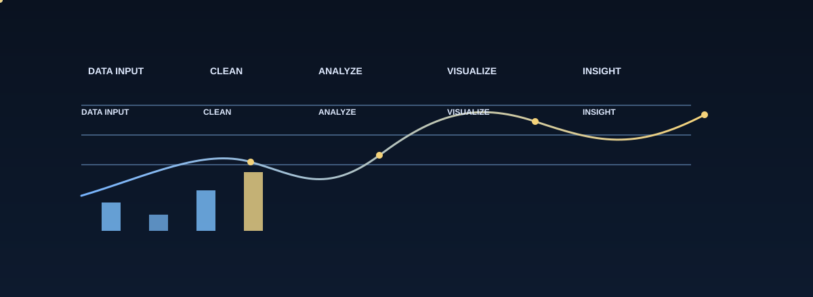
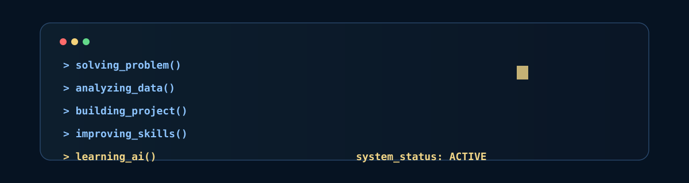
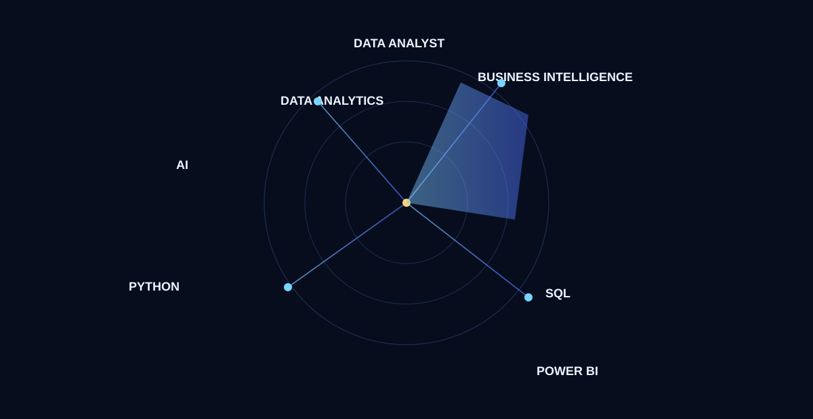
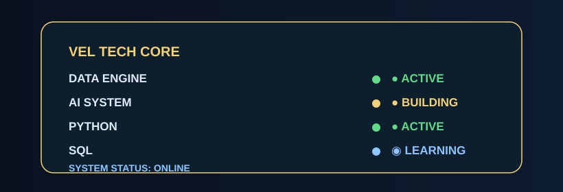

# SARAVANA VEL // LIVE TECH CORE

<div align="center">
  
</div>

<h1 align="center" style="margin: 0; font-size: 2.8rem; letter-spacing: 0.16em; color: #f6d98f;">SARAVANA VEL</h1>

<p align="center" style="font-size: 1.15rem; font-weight: 700; color: #dfeafe; margin-top: 10px; margin-bottom: 0;">
  ASPIRING DATA ANALYST • AI ENTHUSIAST • PYTHON DEVELOPER
</p>

<p align="center" style="font-size: 0.98rem; color: #8fc7ff; margin-top: 8px; margin-bottom: 18px;">
  DATA • AI • PYTHON • ANALYTICS • PROJECTS
</p>

<p align="center">
  <a href="https://github.com/saravanavel07" target="_blank">
    
  </a>
  <a href="https://www.linkedin.com/in/saravana-vel-ba4937280/" target="_blank">
    
  </a>
  <a href="#project-command-center">
    
  </a>
</p>

<p align="center">
  
</p>

<p align="center">
  
</p>

---

## VEL // LIVE TECH CORE

I am building a practical foundation in data analysis, Python, SQL, AI, and technology-driven problem solving. This profile reflects my current journey: learning continuously, building projects, analyzing patterns, and exploring how data and AI can create meaningful outcomes.

- Aspiring Data Analyst
- AI Enthusiast
- Python Developer
- Learning SQL, Power BI, APIs, and AI workflows
- Developing project-based technical exploration

---

## ABOUT SARAVANA VEL

I’m growing my skills in:

- Python — Intermediate
- Excel — Intermediate
- Data Analysis — Intermediate
- SQL — Beginner
- Java — Basics
- Power BI
- APIs
- AI
- Prompt Engineering
- Data Science fundamentals
- Git / GitHub

My focus is to build strong foundations in analytics, decision support, automation, and AI-assisted development while staying honest about where I am in the learning curve.

---

## TECH STACK

<div align="center">
  
</div>

### Core
- Python
- Excel
- Data Analysis

### Developing
- SQL
- Power BI
- DSA

### Exploring
- AI
- Prompt Engineering
- APIs
- Docker
- CI/CD
- Grafana

---

## DATA ANALYTICS ENGINE

<div align="center">
  
</div>

```text
DATA INPUT
   ↓
CLEAN
   ↓
ANALYZE
   ↓
VISUALIZE
   ↓
INSIGHT
```

---

## PROJECT COMMAND CENTER

<div align="center">
  
</div>

### Active ecosystem
- API Hub
- Quantizer AI
- APTI DUDE
- Cracker AI
- Harness Prompt Creator

### Project focus
- API integrations and developer workflows
- AI experimentation and data-driven ideas
- Structured learning and project execution
- Prompt engineering and practical tools

---

## CODING JOURNEY

<div align="center">
  
</div>

### Problem solving and learning
- LeetCode: https://leetcode.com/saravana_6/
- GitHub: https://github.com/saravanavel07

```text
> solving_problem()
> analyzing_data()
> building_project()
> improving_skills()
> learning_ai()
> system_status: ACTIVE
```

---

## CAREER RADAR

<div align="center">
  
</div>

```text
DATA ANALYST
BUSINESS INTELLIGENCE
AI
PYTHON
SQL
DATA SCIENCE
```

---

## LEARNING

<div align="center">
  
</div>

```text
CURRENT DIRECTION
- Aspiring Data Analyst
- AI focused learning
- Python and data workflow practice
- Project-based skill building
```

---

## CERTIFICATIONS

- IBM — Data & AI learning path
- Microsoft — Technical learning path
- AWS — Cloud learning exploration
- Kaggle — Data science practice
- Course-based analytics learning
- Self-directed AI and prompt engineering practice

These are part of a real learning journey and are represented as ongoing professional growth.

---

## GITHUB ANALYTICS

<div align="center">
  
</div>

<div align="center">
  
</div>

---

## CONNECT

- GitHub: https://github.com/saravanavel07
- LinkedIn: https://www.linkedin.com/in/saravana-vel-ba4937280/
- LeetCode: https://leetcode.com/saravana_6/

---

<div align="center">
  
</div>

<p align="center" style="font-size: 1.1rem; font-weight: 700; letter-spacing: 0.18em; color: #f4d27a;">
  BUILD • LEARN • ANALYZE • CREATE • IMPROVE • REPEAT
</p>

<h3 align="center" style="color: #dfeaff; margin-top: 8px; margin-bottom: 40px; letter-spacing: 0.18em;">SARAVANA VEL</h3>

<p align="center" style="color: #8fc7ff;">DATA • AI • TECHNOLOGY</p>

---

> This profile is a living, GitHub-compatible visual identity representing my current journey in data, AI, and technology. It is designed to reflect growth, learning, and focused technical exploration.

