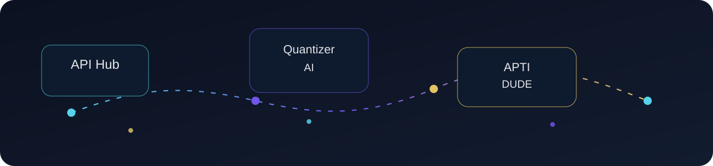

<div align="center">
  
</div>

<h1 align="center" style="margin: 0; font-size: 2.7rem; letter-spacing: 0.1em; color: #f5d57a;">SARAVANA VEL</h1>

<p align="center">
  
</p>

<p align="center" style="font-size: 1.2rem; font-weight: 600; color: #dfe7ff; margin-top: 16px;">
  Aspiring Data Analyst • AI Enthusiast • Developer
</p>

<p align="center" style="color: #9bb9ff; font-style: italic; margin-top: 8px;">
  Turning data, code, and AI into practical solutions.
</p>

<p align="center">
  <a href="https://github.com/saravanavel07">
    
  </a>
  <a href="https://www.linkedin.com/in/saravana-vel-ba4937280/">
    
  </a>
  <a href="https://leetcode.com/saravana_6/">
    
  </a>
</p>

<p align="center">
  
  
  
  
  
</p>

---

## About Me

I’m learning and building steadily in the space of data analytics, Python, AI, and practical software development. My focus is on understanding real-world problems, improving technical fundamentals, and creating projects that connect data, insight, and decision-making.

I’m currently developing:
- Data analysis and visualization skills
- Python and SQL fundamentals
- AI and prompt engineering workflows
- Practical project building
- Problem solving and DSA consistency
- Readiness for software, data, and AI opportunities

---

## My Tech Stack

### Programming
<p align="left">
  
  
  
</p>

### Data & Analytics
<p align="left">
  
  
  
  
</p>

### AI & Technology
<p align="left">
  
  
  
  
</p>

### Developer Tools
<p align="left">
  
  
  
  
  
</p>

---

## Featured Projects

<div align="center">
  
</div>

### API Hub
- Description: A centralized API-focused project platform to explore and organize API workflows.
- Technologies: Python, APIs, Git, GitHub
- Status: In progress
- GitHub: `YOUR_REPOSITORY_URL`
- Demo: Not available

### Quantizer AI
- Description: A futuristic AI and data-science concept focused on agentic AI and data workflows.
- Technologies: Python, AI, Data Science, APIs, Prompt Engineering
- Status: Concept / early prototype
- GitHub: `YOUR_REPOSITORY_URL`
- Demo: Not available

### APTI DUDE
- Description: An aptitude and IQ learning platform covering logical reasoning, verbal ability, reasoning, and progressive challenge levels.
- Technologies: Python, Data Processing, Analytics, Learning Tools
- Status: Concept / in development
- GitHub: `YOUR_REPOSITORY_URL`
- Demo: Not available

### Cracker AI
- Description: An open-source, data-science and plugin-oriented AI project focused on practical experimentation.
- Technologies: Python, AI, Data Science, APIs, Open-source tooling
- Status: Exploring
- GitHub: `YOUR_REPOSITORY_URL`
- Demo: Not available

### Harness Prompt Creator
- Description: A Python-based prompt engineering project designed to improve prompts through iterative refinement.
- Technologies: Python, AI, Prompt Engineering, GitHub
- Status: Building
- GitHub: `YOUR_REPOSITORY_URL`
- Demo: Not available

> Replace every `YOUR_REPOSITORY_URL` placeholder with a real repository link when available.

---

## DATA → INSIGHT → DECISION

<p align="center">
  
</p>

```text
Raw Data
   ↓
Cleaning
   ↓
Exploration
   ↓
Analysis
   ↓
Visualization
   ↓
Insights
   ↓
Decision
```

---

## Current Learning

<p align="center">
  
  
  
  
  
  
  
  
  
</p>

---

## Coding Journey

### Coding platforms
<p align="left">
  <a href="https://leetcode.com/saravana_6/">
    
  </a>
  <a href="https://www.hackerrank.com/">
    
  </a>
  <a href="https://www.codechef.com/">
    
  </a>
</p>

- LeetCode username: `saravana_6`
- HackerRank: `YOUR_HACKERRANK_USERNAME`
- CodeChef: `YOUR_CODECHEF_USERNAME`

> Dynamic statistics may rely on third-party services. This static profile card is the reliable fallback if those services are unavailable.

---

## GitHub Analytics

<p align="center">
  
</p>

<p align="center">
  
</p>

<p align="center">
  
</p>

> If a stats service is temporarily unavailable, the page remains readable and the profile still works without it.

---

## Achievements

- HackerRank Python progress
- Coding practice and problem-solving consistency
- Data analytics learning journey
- IBM learning
- Microsoft learning
- AWS learning
- Kaggle participation
- Technical learning milestones
- AI learning and prompt engineering exploration

> Use exact details when available. Keep placeholders where information is still being updated.

---

## Certifications

<div align="left">
  
  
  
</div>

- [Certification] — Organization — Year
- [View Certificate] — `YOUR_CERTIFICATE_URL`
- [Certification] — Organization — Year
- [View Certificate] �� `YOUR_CERTIFICATE_URL`

---

## CURRENTLY BUILDING

> Data Analytics + AI + Developer Skills

```text
Python
   +
SQL
   +
Data Analytics
   +
AI
   +
Real Projects
   =
Career Growth
```

---

## Career Target

I’m building toward opportunities in:
- Data Analyst
- Junior Data / BI roles
- AI and data project work
- Software / IT opportunities

I’m focused on learning, improving, and building practical skills with honesty and consistency.

---

## LET'S CONNECT

<p align="center">
  <a href="https://github.com/saravanavel07">
    
  </a>
  <a href="https://www.linkedin.com/in/saravana-vel-ba4937280/">
    
  </a>
  <a href="YOUR_PORTFOLIO_URL">
    
  </a>
  <a href="YOUR_EMAIL_LINK">
    
  </a>
</p>

---

<p align="center">
  
</p>

<p align="center">
  
</p>

---

> Building a strong foundation in data, code, and AI — one project, one skill, and one step at a time.
